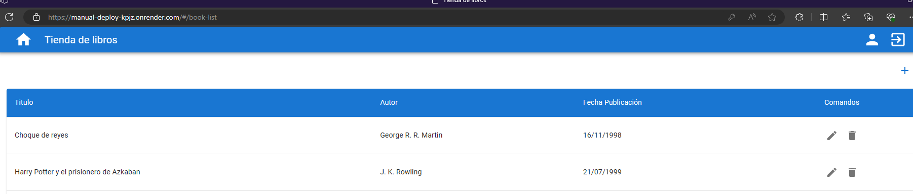

# Basico - despliegue manual

Indice:
- [descripcion del ejercicio](#basico---despliegue-manual)
- [desde el despliegue manual](#partiendo-desde-el-despliegue-manual)
- [Cambios](#los-cambios-necesarios)
- [Para muestra un botón](#para-muestra-un-botón)

para realizar el despliegue manual se han seguido las indicaciones recibidas tanto en los videos como en el readme del proyecto `00-stack-documental/05-cloud/03-mongo-deploy`

En este caso tenemos que realizar una conexión con una base de datos en la nube, para ello vamos a usar mongo y su cluster gratuito para realizar la prueba.

## Partiendo desde el despliegue manual

Hemos aprovechado el repo en que realizamos el despliegue manual [👉 este 👈](https://github.com/adriel87/manual-deploy)

## Los cambios necesarios

en el repo lo que hay que hacer es actualizar la variable de entorno que apunta la dirección de nuestra BBDD, para ello vamos a nuestro dashboard de render y en la variable de entorno `MONGO_URI` usamos la cadena de conexión que podemos recuperar desde el dashboard de mongo. Se ha creado un usuario para que esta base de datos en concreto con los permisos necesarios de lectura/escritura.

## Para muestra un botón

El enlace a la [aplicación 📎](https://manual-mongo-deploy.onrender.com)

en la siguiente imagen vemos el listado de libros creados  

