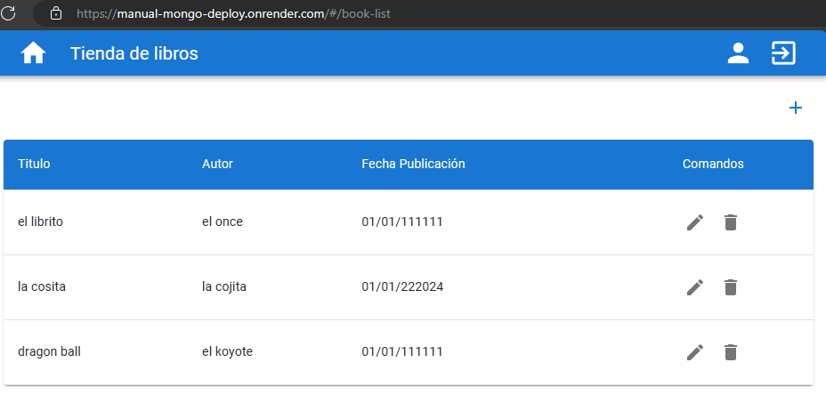

# Basico - despliegue manual

Indice:
- [descripcion del ejercicio](#basico---despliegue-manual)
- [la carpeta dist](#la-carpeta-dist)
- [probando](#probando-nuestro-build)

para realizar el despliegue manual se han seguido las indicaciones recibidas tanto en los videos como en el readme del proyecto `00-stack-documental/05-cloud/02-manual-render-deploy`

## La carpeta dist

en esta carpeta esta el resultado de hacer el build del front, colocar ese paquete en la una carpeta publica en el proyecto del back. Luego hacer un build en el back incluyendo un par de scripts nuevos obtenemos el bundle de nuestra aplicación 

> los scripts
```json
{
    ...
    "clean":"rimraf dist",
    "prebuild": "npm run clean",
    "build": "tsc --project tsconfig.prod.json",
    ...
}
```

una vez obtenido el bundle tenemos que hacer modificaciones en el `package.json`, tenemos que eliminar las dependencias de desarrollo y modificar un poco desde donde estamos haciendo los imports de nuestros scripts
> en este punto tuve un pequeño problema, y es que me fallaba a la hora de ejecutar el script de index.js por que no encontraba los modulos donde se encontraban los archivos


```json
EL FALLO
{
    // aqui un error de tipo provocaba que no pudieramos importar nuestros modulos
    ...
    "imports": {
       "#common/*": "./src/common/*.js",
       }
    ...
}

EL FIX
{
    // necesitaba indicar el tipo de archivo para cuando usara el alias    ...
    "imports": {
       "#common/*.js": "./src/common/*.js",
       }
    ...
}
```


## Probando nuestro build

en este punto solo nos quedaba conectar nuestro repo con render para que poder levantar nuestro aplicativo

siguiendo el readme me cree un nuevo repo privado

[👉 el repo 👈](https://github.com/adriel87/manual-deploy)

fue durante la fase de deploy que me di cuenta del fallo de los ***imports***, asi que siempre es bueno probar que todo esto nos funcione en local

una vez solucionado lo de los import, se realizo con exito el deploy y pude [probar la app](https://manual-deploy-kpjz.onrender.com/)




